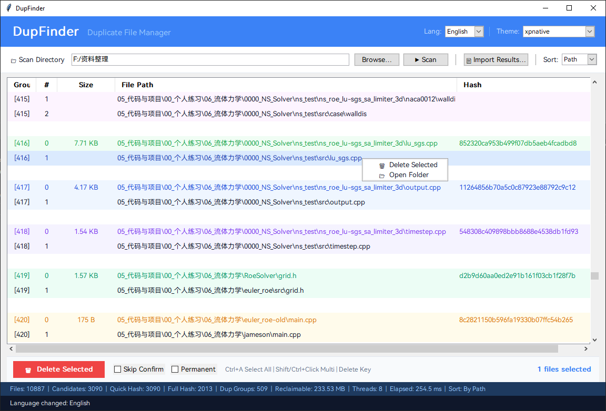

# DupFinder

A simple and fast duplicate file finder & remover for personal use, powered by a C++ scanning engine and a Python GUI.

[中文文档](README_CN.md)

> **Disclaimer**: This is a personal utility, not a production-grade product. It has been tested on **Windows 10 22H2** and **macOS 15 Sequoia (Apple Silicon)**. Please back up your data before use.
>
> Bug reports and compatibility feedback are welcome via Issues, though I may not always have the bandwidth to address them. The codebase is intentionally small and straightforward — pull requests for new features, improvements, or platform support are very much appreciated!

## Screenshot



## Features

- **Three-stage high-speed scan**: file-size grouping → quick hash (xxHash, first 4 KB) → full/sampled hash (xxHash 128-bit); large files are sampled at head / middle / tail only
- **OpenMP multi-threaded** hash computation
- **GUI**: scan, browse, and delete in one place; supports recycle-bin or permanent deletion
- **Bilingual UI** (Chinese / English), switchable at runtime
- **Multiple themes** with auto-saved preferences
- **Cross-platform**: supports Windows and macOS

## Build & Install

### Windows

#### Prerequisites

- Windows 10/11
- Visual Studio with C++ Desktop Development workload (tested with VS 2022)
- CMake ≥ 3.14
- Python ≥ 3.10

#### One-click Build

```bat
build_and_install.bat
```

The script runs CMake configure → build → install to `install/`, then installs Python dependencies via pip.

#### Manual Build

```bat
cmake -B build -A x64 -DCMAKE_INSTALL_PREFIX=install
cmake --build build --config Release
cmake --install build --config Release
pip install -r requirements.txt
```

#### Run

```bat
python install\dupfinder_ui.py
```

---

### macOS

#### Prerequisites

- macOS 12+ (tested on macOS 15 Sequoia, Apple Silicon)
- Xcode Command Line Tools (`xcode-select --install`)
- [Homebrew](https://brew.sh/)
- CMake ≥ 3.14 (`brew install cmake`)
- Python 3.10+ (Homebrew version recommended)

#### Install System Dependencies

```bash
# Install CMake if not already installed
brew install cmake

# OpenMP support (Apple Clang does not ship with OpenMP)
brew install libomp

# Python with Tkinter support (system Python may lack Tkinter)
brew install python@3.13 python-tk@3.13
```

#### One-click Build

```bash
./build_and_install.sh
```

The script will:
1. Check and prompt to install missing Homebrew dependencies
2. Configure and build the C++ engine via CMake
3. Install to `install/`
4. Create a Python virtual environment (`install/venv/`)
5. Install Python dependencies into the venv

#### Manual Build

```bash
# Build C++ engine
cmake -B build -DCMAKE_BUILD_TYPE=Release -DCMAKE_INSTALL_PREFIX=install
cmake --build build --config Release
cmake --install build --config Release

# Create Python virtual environment and install dependencies
python3 -m venv venv
source venv/bin/activate
pip install -r requirements.txt
```

#### Run

```bash
# Activate the virtual environment first
source venv/bin/activate          # if built manually
# or
source install/venv/bin/activate  # if built with build_and_install.sh

# Run the GUI
python3 dupfinder_ui.py           # from project root
# or
python3 install/dupfinder_ui.py   # from install directory
```

#### Why a Virtual Environment?

macOS (Homebrew Python 3.12+) enforces [PEP 668](https://peps.python.org/pep-0668/), which prevents installing packages directly into the system Python. A virtual environment (`venv`) creates an isolated Python environment where project dependencies (sv-ttk, send2trash, ttkthemes) are installed locally without affecting the system.

---

## Packaging for Release

To create a standalone distributable package (no Python installation required on the target machine):

```bash
# macOS
./package_release.sh

# Windows
package_release.bat
```

The script uses [PyInstaller](https://pyinstaller.org/) to bundle the Python GUI with all dependencies into a standalone application. Output:

- **macOS**: `dist/dupfinder-macos-arm64.zip` containing `dupfinder.app`
- **Windows**: `dist/dupfinder-windows-x64/` containing `dupfinder.exe` + `dupfinder_engine.exe`

Users can download and run these packages directly without installing Python, CMake, or any dependencies.

---

## Project Structure

```
├── src/dupfinder_main.cpp    # C++ scan engine
├── dupfinder_ui.py           # Python GUI
├── dupfinder_strings.json    # i18n string resources
├── font/                     # UI font files
├── CMakeLists.txt            # CMake build configuration
├── build_and_install.bat     # One-click build script (Windows)
├── build_and_install.sh      # One-click build script (macOS)
├── package_release.sh        # Release packaging script (macOS)
├── package_release.bat       # Release packaging script (Windows)
├── requirements.txt          # Python dependencies
└── thirdparty/xxhash/        # xxHash source (bundled)
```

## Acknowledgements

- [xxHash](https://github.com/Cyan4973/xxHash) — extremely fast hash algorithm, BSD-2-Clause license
- [HarmonyOS Sans SC](https://developer.huawei.com/consumer/en/design/resource/) — Huawei HarmonyOS design font, included in the `font/` directory and subject to its official license

## Development

Code and documentation were written with the assistance of **Claude Opus 4** in the [Cursor](https://www.cursor.com/) IDE.

## License

[MIT](LICENSE)
