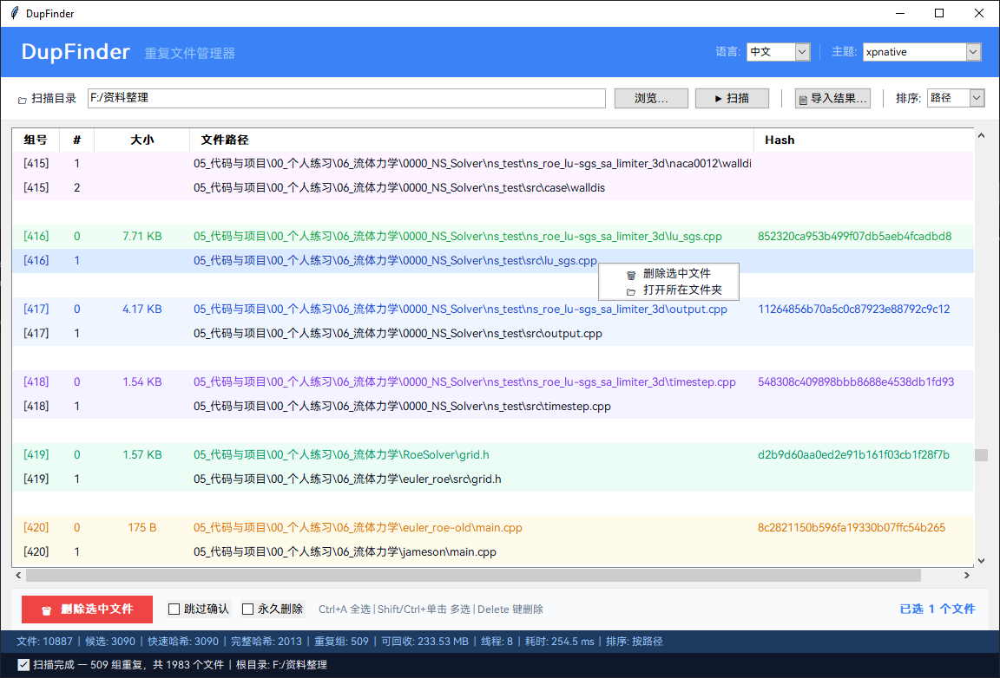

# DupFinder — 重复文件查找与删除工具

一个供个人使用的重复文件筛选删除小工具，由 C++ 高性能扫描引擎 + Python GUI 界面组成。

> **声明**：本项目是个人用途的小工具，没有经过充分的产品化测试，已在 **Windows 10 22H2** 和 **macOS 15 Sequoia (Apple Silicon)** 上测试通过。请在使用前做好数据备份。
>
> 如果遇到功能或兼容性问题，欢迎通过 Issues 反馈，但作者不一定有精力及时维护或修复。代码逻辑和结构都比较简单，非常欢迎大家提交 PR 来补全或增强功能！

## 截图



## 功能

- **三阶段高速扫描**：文件大小分组 → 快速哈希 (xxHash, 前 4KB) → 完整/采样哈希 (xxHash 128-bit)，大文件仅采样头/中/尾三段
- **OpenMP 多线程**加速哈希计算
- **GUI 界面**：扫描、浏览、删除一体化操作；支持删除到回收站或永久删除
- **中/英双语**界面，可动态切换
- **多主题**支持，偏好自动保存
- **跨平台**：支持 Windows 和 macOS

## 构建与安装

### Windows

#### 环境要求

- Windows 10/11
- Visual Studio（需含 C++ 桌面开发工作负载；测试环境为 VS 2022）
- CMake ≥ 3.14
- Python ≥ 3.10

#### 一键构建

```bat
build_and_install.bat
```

脚本会依次完成 CMake 配置、编译、安装到 `install/` 目录，以及通过 pip 安装 Python 依赖。

#### 手动构建

```bat
cmake -B build -A x64 -DCMAKE_INSTALL_PREFIX=install
cmake --build build --config Release
cmake --install build --config Release
pip install -r requirements.txt
```

#### 运行

```bat
python install\dupfinder_ui.py
```

---

### macOS

#### 环境要求

- macOS 12+（测试环境：macOS 15 Sequoia, Apple Silicon）
- Xcode 命令行工具（`xcode-select --install`）
- [Homebrew](https://brew.sh/)
- CMake ≥ 3.14（`brew install cmake`）
- Python 3.10+（推荐使用 Homebrew 版本）

#### 安装系统依赖

```bash
# 安装 CMake（如果尚未安装）
brew install cmake

# 安装 OpenMP 支持（Apple Clang 不自带 OpenMP）
brew install libomp

# 安装带 Tkinter 支持的 Python（系统自带的 Python 可能缺少 Tkinter）
brew install python@3.13 python-tk@3.13
```

#### 一键构建

```bash
./build_and_install.sh
```

脚本会自动完成以下步骤：
1. 检查并提示安装缺失的 Homebrew 依赖
2. 通过 CMake 配置并编译 C++ 引擎
3. 安装到 `install/` 目录
4. 创建 Python 虚拟环境（`install/venv/`）
5. 在虚拟环境中安装 Python 依赖

#### 手动构建

```bash
# 编译 C++ 引擎
cmake -B build -DCMAKE_BUILD_TYPE=Release -DCMAKE_INSTALL_PREFIX=install
cmake --build build --config Release
cmake --install build --config Release

# 创建 Python 虚拟环境并安装依赖
python3 -m venv venv
source venv/bin/activate
pip install -r requirements.txt
```

#### 运行

```bash
# 先激活虚拟环境
source venv/bin/activate          # 手动构建时
# 或
source install/venv/bin/activate  # 使用一键构建脚本时

# 启动 GUI
python3 dupfinder_ui.py           # 在项目根目录
# 或
python3 install/dupfinder_ui.py   # 在 install 目录
```

#### 为什么需要虚拟环境（venv）？

macOS 上 Homebrew 安装的 Python 3.12+ 遵循 [PEP 668](https://peps.python.org/pep-0668/) 规范，**禁止直接向系统 Python 安装第三方包**。虚拟环境（`venv`）会创建一个隔离的 Python 环境，项目所需的第三方依赖（sv-ttk、send2trash、ttkthemes）安装在其中，不会影响系统环境。

---

## 打包发布

如需创建独立分发包（目标机器无需安装 Python）：

```bash
# macOS
./package_release.sh

# Windows
package_release.bat
```

脚本使用 [PyInstaller](https://pyinstaller.org/) 将 Python GUI 及所有依赖打包为独立应用。产出：

- **macOS**：`dist/dupfinder-macos-arm64.zip`，内含 `dupfinder.app`
- **Windows**：`dist/dupfinder-windows-x64/`，内含 `dupfinder.exe` + `dupfinder_engine.exe`

用户下载后即可直接运行，无需安装 Python、CMake 或任何依赖。

---

## 项目结构

```
├── src/dupfinder_main.cpp    # C++ 扫描引擎
├── dupfinder_ui.py           # Python GUI
├── dupfinder_strings.json    # 国际化语言资源
├── font/                     # 界面字体文件
├── CMakeLists.txt            # CMake 构建配置
├── build_and_install.bat     # 一键构建脚本 (Windows)
├── build_and_install.sh      # 一键构建脚本 (macOS)
├── package_release.sh        # 发布打包脚本 (macOS)
├── package_release.bat       # 发布打包脚本 (Windows)
├── requirements.txt          # Python 依赖
└── thirdparty/xxhash/        # xxHash 源码（已包含）
```

## 致谢与第三方资源

- [xxHash](https://github.com/Cyan4973/xxHash) — 极速哈希算法，BSD-2-Clause 许可
- [HarmonyOS Sans SC](https://developer.huawei.com/consumer/en/design/resource/) — 华为 HarmonyOS 设计字体资源，已包含在仓库 `font/` 目录中，该字体遵循其官方许可协议

## 开发说明

本项目的代码与文档在 [Cursor](https://www.cursor.com/) IDE 中借助 **Claude Opus 4** 模型辅助完成。

## License

[MIT](LICENSE)
